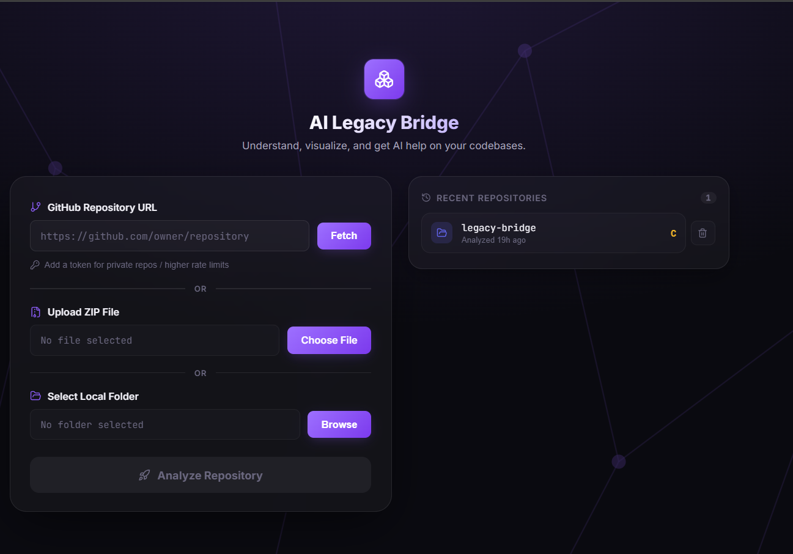
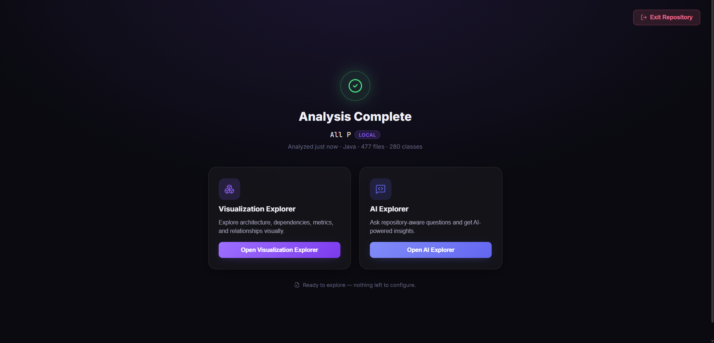
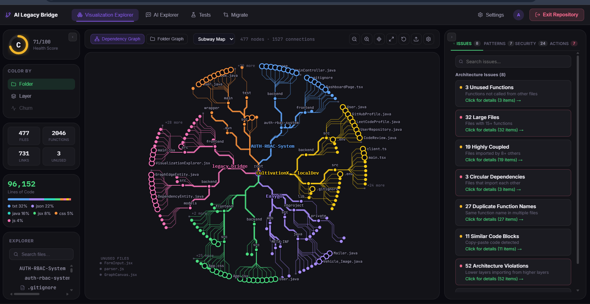
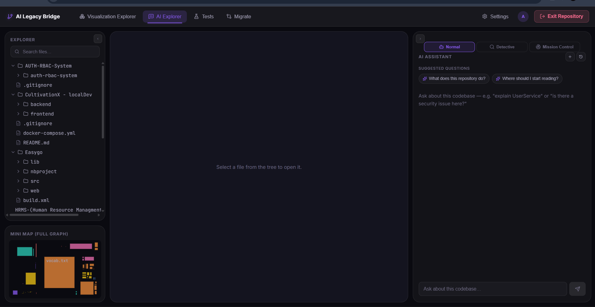
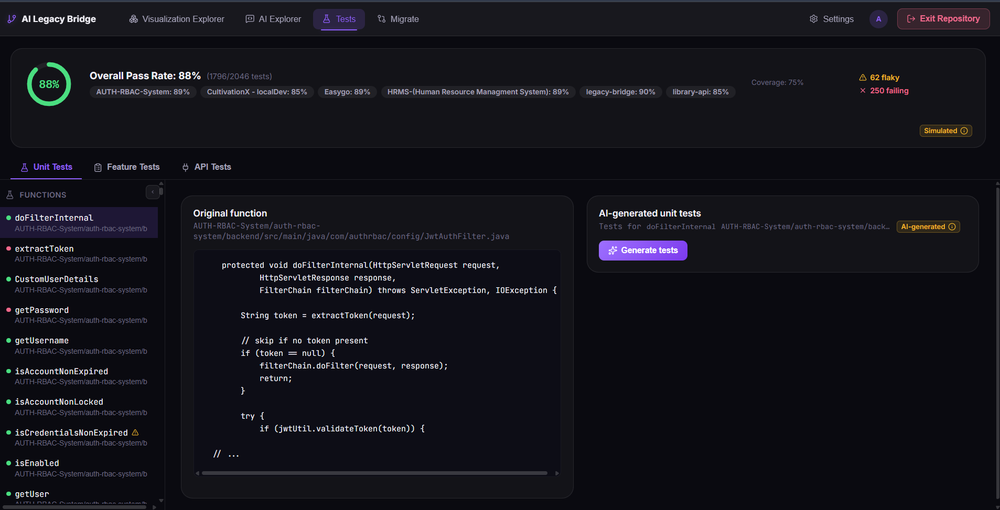
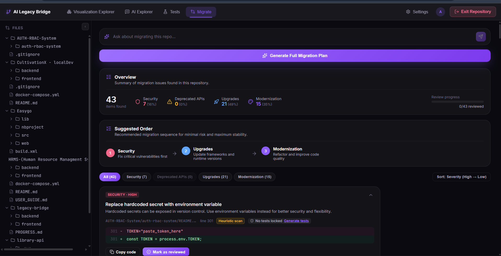

# AI Legacy Bridge — AI-Powered Legacy Code Intelligence Platform

Upload a legacy codebase, get an interactive dependency graph, and ask an AI agent questions about it — with real source-grounded answers, migration suggestions, and auto-generated tests.

<!-- 
  SCREENSHOTS: replace the placeholders below with your own images.
  Put your image files in a `docs/screenshots/` folder in the repo root,
  then update the paths below to match your filenames.
-->

## Screenshots

| Upload & Analyze | WorkSpace Selection |
|---|---|
|  |  |
| Visulization Explorer | Ai Explorer |
|  |  |

| Test you code | Migration Suggestions |
|---|---|
|  |  |

## Overview

AI Legacy Bridge helps developers understand and modernize unfamiliar or legacy codebases. You upload a repository (ZIP, folder, or GitHub link), the frontend's in-browser Analysis Engine parses it into files/classes/functions/dependencies, and the backend stores that structure while a Python AI service indexes it for retrieval-augmented Q&A.

From there you can:
- **Visualize** the codebase as an interactive dependency graph
- **Ask an AI agent** questions about any file, with the currently open file always used as grounded context (not just retrieved chunks)
- **Generate unit tests** for a function
- **Get migration suggestions** for legacy patterns
- Come back later — repositories are saved and reloadable without re-analyzing

## Architecture

```
 Frontend (React + Vite)        Backend (Spring Boot)         AI Service (FastAPI)
 ────────────────────────       ──────────────────────        ──────────────────────
 Analysis Engine (browser)         ingest/  → stores            guardrail check
   parses repo → graph        →    query/   → read APIs    →    GraphRAG retrieval
 UI: Upload / Graph /              storage/ → JPA entities       (pgvector + Neo4j)
     AI Explorer / Tests /         Postgres + pgvector      →    LangGraph agent loop
     Migrate                                                     (tools: read_file,
                                                                   search_code, etc.)
                                                                  evaluation + tests
```

- **Frontend** does the actual code parsing (AST-based) client-side, then posts the finished analysis to the backend — the backend never parses source itself.
- **Backend (Java/Spring Boot)** is the system of record: stores files/classes/functions/dependencies in Postgres, serves the Upload Page's "recent repositories" list, and triggers the AI service to index a repo after ingest.
- **AI service (Python/FastAPI)** owns retrieval and the agent: chunks + embeds code (`sentence-transformers`), mirrors dependencies into Neo4j for **GraphRAG** (semantic similarity + graph proximity combined), runs a **LangGraph** agent with tool-calling and multi-turn memory, and gates every question through a guardrail step.

## Tech Stack

| Layer | Tech |
|---|---|
| Frontend | React 19, Vite, Monaco Editor, D3.js, Acorn (JS parsing) |
| Backend | Java 21, Spring Boot 3.3, Hibernate 6, PostgreSQL + pgvector |
| AI Service | Python, FastAPI, LangChain / LangGraph, Neo4j, sentence-transformers |
| LLM | Groq (Llama 3.3) / Gemini, OpenAI-compatible chat completions |

## Project Structure

```
AI-Legacy-Bridge/
├── frontend/          React + Vite app — upload UI, graph visualization, AI Explorer
├── backend/           Spring Boot service — storage, ingest/query APIs
└── ai-service/         FastAPI service — RAG indexing, LangGraph agent, guardrails
```

## Getting Started

### Prerequisites
- Node.js 18+
- Java 21 + Maven
- Python 3.11+
- PostgreSQL with the `pgvector` extension
- (Optional, for GraphRAG) Neo4j

### 1. Backend

```bash
cd backend
# create the DB/user referenced in application.properties, then:
mvn spring-boot:run
```

Copy `src/main/resources/Example.application.properties` → `application.properties` and fill in your own DB credentials — **never commit real credentials**.

### 2. AI Service

```bash
cd ai-service
pip install -r requirements.txt --break-system-packages
cp example.env .env   # fill in your LLM API key, DB, and (optional) Neo4j config
python -m app.main
```

API docs at `http://localhost:8001/docs`.

### 3. Frontend

```bash
cd frontend
npm install
cp .env.example .env   # point at your backend / ai-service URLs
npm run dev
```

## Features

- 📂 Upload via ZIP, local folder, or GitHub URL
- 🕸️ Interactive dependency graph (files, classes, functions, imports)
- 🤖 AI Explorer — ask questions grounded in real source, not just guesses
- 🧪 Auto-generated unit tests for a selected function
- 🔧 Migration suggestions for legacy code patterns
- 💾 Session persistence — reopen a previously analyzed repository instantly

## Known Limitations

- No authentication yet — intended for local/dev use
- AI Explorer doesn't yet pass a per-tab `sessionId` from the UI, so multi-turn memory currently defaults to being shared per repository
- `ai-service`'s guardrail and evaluation layers are prompt-based (LLM-as-judge), not the actual LlamaGuard/Ragas packages

## Author

Built by [Aaditya](https://github.com/aadityahammad-2002)
